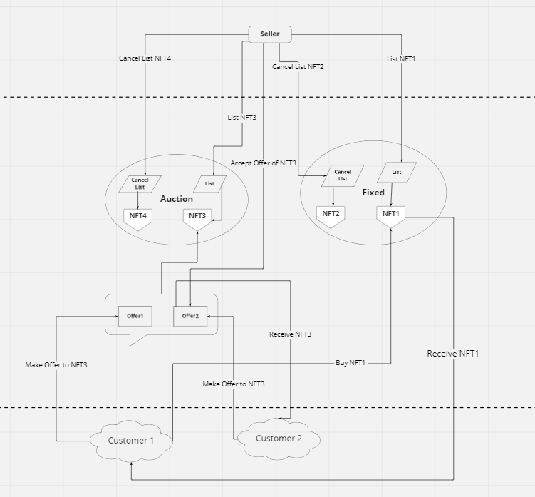

# blockchain-coding-challenge

## Basic

### 1. Explain the difference between ERC721 and ERC 1155 NFT tokens standards. Provide some examples where you would use both.
    
    -----------------------------------------------------------------------------------------
    |                   ERC721                    |                  ERC1155                |
    -----------------------------------------------------------------------------------------
    | Individual transactions and smart contracts | Single, smart contracts of ERC-1155     |
    | are required for each token type.           | tokens can support multiple functions.  |
    -----------------------------------------------------------------------------------------
    | No support for batch transfers              | Support for single and batch transfers  |
    -----------------------------------------------------------------------------------------
    | Only support the creation of non-funible    | Support conversion of fungible tokens   |
    | tokens                                      | to NFTs and vice versa                  |
    -----------------------------------------------------------------------------------------
    | Impossible to revert transactions after     | Safe transfer function enables          |
    | transferring assets to the wrong address    | verification of transaction validity    |
    |                                             | and reverse the transactions            |
    -----------------------------------------------------------------------------------------

* 1st difference: 
  The best thing about ERC 1155 is that the smart contracts could offer support for an unlimited assortment of tokens.
  On the contrary, the ERC-721 token standard implies the need for new smart contracts for transactions with each type of token.

* 2nd difference: 
  We can use the ERC-1155 token standard as vital support for facilitating batch transfers of tokens.
  The facility of batch transfers plays a crucial role in reducing the transaction costs and time associated with each transaction.
  On the other hand, ERC 721 token standard implies the need for creating an individual smart contract for transferring each NFT or token.
  If you plan on sending multiple NFTs in an ERC-721 system, then you have to create transactions for individual NFTs.
  As a result, the load on the network increases by massive margins, thereby leading to congestion and increased transaction cost and time.

* 3rd difference: 
  Semi-fungible tokens bring the best of both by enabling the conversion of fungible tokens into NFTs or vice versa. 
  ERC 1155 token standard offers the flexibility for creating semi-fungible tokens.
  Most important of all, the ability to convert digital or real-world assets into NFTs or vice versa is a huge advantage for the ERC-1155 token standard.

* 4th difference: 
  With the ERC-721 standard, you don’t have the facility for reclaiming your assets if you transferred them to the wrong address.
  On the contrary, the ERC-1155 token standard offers a unique feature known as the ‘safe transfer’ function.
  The safe transfer function is a product requirement for evaluating a transaction’s validity and also enables hassle-free token transfers.

  For example, both of ERC721 and ERC1155 can be used in online gaming. ERC1155 can be used for characters and ERC721 can be used for rare items.

### 2. Provide a basic boilerplate/environment example that you use (or would use) for smart contract development

* For smart contract development, several boilerplate libraries and services exist.
  Openzeppelin, ERC721A, Moralis-boilerplate, …
* And several frameworks support environment for smart contract development.
  Truffle, Hardhat, Remix, Brownie, …

  I have used Openzeppelin, ERC721A and worked with above all frameworks.
  Personally, I prefer Openzeppelin contracts as library and also prefer Hardhat as framework.

## Practical

### Choose one of the use-cases:

A) NFT Marketplace - Users can sell and buy their NFTs in a gas-efficient way
B) NFT Lending - Users can list their NFTs for rent (imagine Airbnb for NFTs)

I choose A(NFT Marketplace)

### Complete these tasks:

#### 1. Design an MVP technical solution for the use case (on-chain vs. off-chain, how it ties together)

NFT marketplace is a platform to allow users trade their NFTs for sale.
We can save data to on-chain storage, but too much transaction costs are consumed, so we use off-chain.
    
    General Description               Type                      Category
    --------------------------------------------------------------------
    Buy NFT                           On-chain                  Buy
    List NFT for fixed                On-chain, Off-chain       List
    Cancel listed NFT for fixed       Off-chain                 List
    List NFT for auction              On-chain, Off-chain       List
    Cancel listed NFT for auction     Off-chain                 List
    Make offer for auction            On-chain, Off-chain       Bid
    Cancel offer for auction          Off-chain                 Bid
    Accept offer for auction          On-chain                  Sell

#### 2. Write a high-level description explaining your solution
  
NFT marketplace is a platform for trading NFTs. People can list their NFTs and buy NFTs from others.
Basically NFT marketplace has several functionalities like List, Buy, and Auction.
There are many NFT marketplaces - Opensea, Rarible, Magiceden …
I am going to build NFT marketplace like that. As you can see above table, marketplace has list, buy, sell and auction features. 

This is a diagram according to my solution.
* **List on fixed:**
  Owners of NFT list their NFT on fixed-sale with fixed price so that other people can buy them.
* **Cancel list on fixed:**
  Owners list NFT down from fixed-sale.
* **Buy:**
  People purchase listed NFTs on sale. After buying, owner of NFT is changed and NFT is listed down from sale.
* **List on auction:**
  Owners list NFT on auction with basic price and auction duration. 
  Duration is expired, NFT is automatically listed down from auction.
  In “expire” case, if  there are one and more Offers, NFT isn’t listed down and people can’t make offer anymore.
* **Cancel list on auction:**
  That is same with “Cancel list on sale”. In case, NFT has offers, it is available.
* **Make offer:**
  Submit proposal to NFTs on auction.
  It is available with equal or higher price than basic price under auction duration. Thus, NFT’s price is raised by offers.
* **Cancel offer:**
  Withdraw their proposal.
* **Accept offer:**
  Owners accept one of proposals. So owner of NFT is changed and NFT is listed down on auction.

When build smart contract, usually build it so that all info is saved to on-chain storage. But that cause high gas costing issues. Can waste too much for transaction costs.
With usage of off-chain, we can solve this problem easily. Off-chain support non-transactional data that is too large to be stored in the blockchain efficiently, or requires the ability to be changed or deleted.

When you are interacted with Opensea, you have propably been asked to “sign” message or piece of data to authenticate yourself.
New signature is created when sign message. That signature includes all information of message.

For example, when people list NFT, they set NFT’s price.  Signature hold NFT price, owner address and etc.
When make listing and canceling NFT and make and cancel offer, those are no required transaction cost.
For buying and selling NFT, it is consumed transaction cost.

To implement these functionalities, I'll use web3.js and EIP712.
Because web3.js supports to make signatures and EIP712 support to verify them and check validation. Therefore, this becomes on-chain and off-chain flow.

#### 3. Write possible improvements to the MVP, any risks, and possible optimizations that you identify.

- Possible improvements to the MVP
  * **Make offer to interested NFT to buy:** 
  Submit proposal with lower price than listed price in order to buy. And owner can see all proposals and also can accept one of these offers.
  * **Set up the receiver address when buy NFT:** 
  When a user buy NFT, can set up the receiver address.
  For example, the buyer is going to buy NFT and send it to a friend as a gift. In this case, the buyer can set up the receiver address with his friend’s address, can reduce transaction costs and one step for transferring NFT to a friend manually.
  * **Can split the auction into 2 types:** English auction and Dutch auction like opensea
- Any Risk
  * **Changed owner address of listed NFT:** 
  After listing NFT on sale or auction, if the owner transfer NFT to another account, can’t buy NFT or accept offers.
  * **Lack of allowance of payment token amount for auction 1:** 
  In auction, we use wrapper coins (for example, WETH) for trading.
  Before making an offer, the buyer approves marketplace for transferring some amount of payment token.
  After making an offer with approving bid price, there's possible that bider can reset the allowance amount with lower amount. In this case, there will be any risk when finish the auction with this bid.
  * **Lack of allowance of payment token amount for auction 2:** 
  When making offers to two auctions concurrently, NFTMarketplace only check the allowance of payment token amount for each offer(bid).
  In this case, when user(bider) buy the first NFT auction, the allowance of payment token has reduced and isn't enough for purchasing second NFT auction with payment token.
- Possible optimization
  * **Project codebase optimization:** Can refactoring the listing NFT on sale and listing NFT on auction into 1 function by adding listingType member and endPeriod.

#### 4. Optional Bonus: Provide a simple proof-of-concept implementation.
Proof of concept is a process of determining whether a Blockchain project idea can be feasible in a real-world situation.
Tokenomics, Roadmap, Launch, Colligate result with Roadmap and Evaluate

